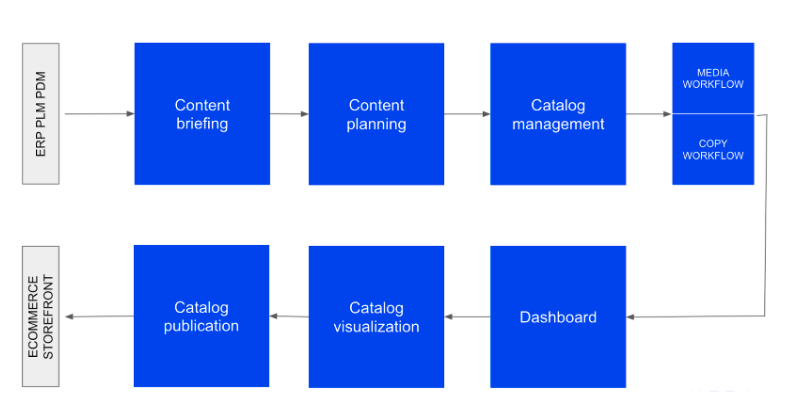

# CDMF 1.0 API

CATALOG DATA MASTER FEED API

## INTRODUCTION

The purpose of this document is to describe to a partner or system integrator how to use the **Catalog Data Master Feed
Service (CDMF) API**.

It is an HTTP API composed of two requests:

* One to provide to an external system up-to-date valid and not yet published data.
* One to confirm what has been published by the external system.

To better identify the CDMF role in SeeCommerce, here below is the schema of the whole architecture. The CDMF is on the
top right corner:


From a logical point of view, the information flow is the following:



The CDMF operates in the last step:


## MISSION STATEMENT

The **CDMF Service** is the mechanism that allows a customer or a system integrator to get from SeeCommerce all the
content marked as publishable for a specific catalog (or even all of them), in order to publish it on one or more other
systems (e.g. an e-commerce site).

The response depends on the configuration for the specific customer in terms of the product structure (e.g. keys,
aggregation levels and attributes).

## API STRUCTURE

The CDMF is comprised of two related HTTP endpoints:

* One provides to an external system:
    * All the contents (media and attributes) of the products which have been marked as publishable in SeeCommerce for
      one or more catalogs.
    * All media contents that are not valid anymore.
* The other one can be called by the external system to confirm what has been published, so that the CDMF won't send
  it (unless something changes).

By default, the first endpoint returns content marked as ready but not yet confirmed. Content marked as ready and
content already confirmed are returned by setting the fullData query parameter as described below.

In other words, the external system will call the first URL to get the list of product data (attributes, media contents
and their invalidations) with one of these two possibility:

- contents currently marked as publishable.
- contents currently marked as publishable and for which no confirmation has been received. (default behavior)

> **Attributes** can be *global* (single value), *multi-catalog* (one value for catalog) or even *multi-language* (one value for catalog's language).
>
> **Media contents** are unique and can belong to multiple catalogs.

Once the list has been received, the external system can send a second request to confirm the publication of the
received products (or only some of them).

To confirm the publication, the external system must use the same keys present in the first response.

Once the external system requests a new list of publishable items, the response, by default, will not contain the items
which have been already confirmed.

An item for which a publication confirmation has been received will be included again in the response of the first call
whenever it is modified.

### Publishable items API

Once a JWT token is obtained, the HTTPS request to get the publishable items must be done to the following URL:

|Request Type | Environment | Swagger Definition |
|---|---|---|
|GET | TEST | [api-test.wardacloud.com/cdmf/publishable](/swagger/#tag/Catalog-Data-Master-Feed/paths/~1cdmf~1publishable/get) |
|GET | PROD | [api.wardacloud.com/cdmf/publishable](/swagger/#tag/Catalog-Data-Master-Feed/paths/~1cdmf~1publishable/get) |

The following headers are required:

|Header|Content|Description|
|---|---|---|
|`Authorization`|`Bearer <JWT Token>`| The authorization token according to the JWT standard|

The following query string parameters can be specified:

|Query parameter | Value |
|---|---|
| catalog  | Name of the specific catalog. If not specified, all the publishable items of all the relevant catalogs will be provided. |
| product  | Identifier of the specific product to request. |
| fullData | Boolean parameter to specify if we want only the content marked as ready but not yet confirmed by the caller user (value: false) or if we want both the content marked as ready but not yet confirmed and the content already confirmed by the the caller user (value: true). Default: false |

> Query parameters can also be **combined**.
>
> Values of parameters need to be correctly **[URL encoded](https://developer.mozilla.org/en-US/docs/Glossary/percent-encoding)**.

For example to filter the product `product://testCode/` with the catalog `testCatalog` the URL to use will be:

```
https://api-test.wardacloud.com/cdmf/publishable?catalog=testCatalog&product=product%3A%2F%2FtestCode%2F
```

The response has the following structure (according to the type system [Flow](https://flow.org/)):

```typescript
type Products = {
    requestTimestamp: Timestamp,
    items: Array<Entity>
}

type Timestamp = string

type Entity = {
    key: EntityKey,
    versionTimestamp: Timestamp,
    data: { [AttributeName]: AttributeValue },
    children: Array<Entity>,
    mediaContents: Array<MediaContent>,
    invalidations: Array<MediaContentInvalidation>,
    completion: Completion
}

type EntityKey = string

type Completion = {
    catalogMediaCompletion: CatalogCompletion,
    plainAttributesCompletion: CatalogCompletion,
    multiCatalogAttributesCompletion: CatalogCompletion,
    multiLanguageAttributesCompletion: CatalogLanguageCompletion,
    entityMediaCompletion: boolean,
    entityMasterAttributeCompletion: boolean,
    productMediaCompletion: boolean,
    productMasterAttributeCompletion: boolean
}

type AttributeName = string
type AttributeValue = { [Catalog]: ?AttributeCatalogValue }
type Catalog = "__MASTER__" | string
type PlainAttributeValue = string
    | boolean
    | Array<string>
    | DictionaryEntry
    | Array<DictionaryEntry>
type AttributeCatalogValue = PlainAttributeValue
    | { [Language]: PlainAttributeValue }
type Language = string
type DictionaryEntry = {
    code: string,
    value: string
}

type ViewData = {
    name: ViewName,
    type: ViewType,
    mediaType: MediaType,
    status: ViewStatus,
    category: ViewCategory
}
type ViewName = string
type ViewType = "MANDATORY" | "OPTIONAL"
type MediaType = "SHOOTING" | "POST_PRODUCED" | "VIDEO"
type ViewStatus = "DEFAULT" | "REVIEW"
type ViewCategory = "DEFAULT" | "WORN" | "STILL-LIFE"

type MediaContent = {
    fileId: FileId,
    mimeType: string,
    view: ViewName,
    viewData?: ViewData,
    mediaType: MediaType,
    url: URL,
    renditions: { [RenditionCode]: URL },
    catalogs: Array<Catalog>
}
type FileId = string
type URL = string
type RenditionCode = string

type CatalogCompletion = { [Catalog]: boolean }

type CatalogLanguageCompletion = { [Catalog]: LanguageCompletion }

type LanguageCompletion = { [Language]: boolean }

type MediaContentInvalidation = {
    key: EntityKey,
    id: FileId,
    catalog: string,
    view?: ViewName
}
```

Below an example of the JSON output for a hypothetical configuration of the data model:

```json
{
  "requestTimestamp": "2019-03-01T15:45:12Z",
  "items": [
    {
      "key": "XYZ",
      "versionTimestamp": "2019-03-01T10:40:12Z",
      "data": {
        "name": {
          "__MASTER__": "Product XYZ"
        },
        "description": {
          "catalogA": "A description",
          "catalogB": "Another description"
        },
        "marketingDescription": {
          "catalogA": {
            "it": "Una descrizione marketing",
            "en": "A marketing description"
          },
          "catalogB": {
            "it": "Un'altra descrizione marketing",
            "en": "Another marketing description"
          }
        }
      },
      "children": [
        {
          "key": "WCR",
          "versionTimestamp": "2019-03-01T10:40:12Z",
          "data": {
            "placeholder": {
              "catalogA": "...",
              "catalogB": "(...)"
            }
          },
          "children": [
            {
              "key": "PTP",
              "versionTimestamp": "2019-03-01T10:40:12Z",
              "data": {
                "placeholder": {
                  "catalogA": "aaa",
                  "catalogB": "AAA"
                },
                "country": {
                  "catalogA": "Italy",
                  "catalogB": "Italy"
                }
              },
              "children": [],
              "mediaContents": [],
              "completion": {
                "catalogMediaCompletion": {
                  "catalogA": false,
                  "catalogB": false
                },
                "plainAttributesCompletion": {
                  "catalogA": false,
                  "catalogB": true
                },
                "multiCatalogAttributesCompletion": {
                  "catalogA": true,
                  "catalogB": false
                },
                "multiLanguageAttributesCompletion": {
                  "catalogA": {
                    "en": false,
                    "it": true
                  },
                  "catalogB": {
                    "en": false,
                    "it": false
                  }
                },
                "entityMediaCompletion": false,
                "entityMasterAttributeCompletion": false,
                "productMediaCompletion": null,
                "productMasterAttributeCompletion": null
              }
            }
          ],
          "mediaContents": [],
          "completion": {
            "catalogMediaCompletion": {
              "catalogA": false,
              "catalogB": false
            },
            "plainAttributesCompletion": {
              "catalogA": false,
              "catalogB": false
            },
            "multiCatalogAttributesCompletion": {
              "catalogA": true,
              "catalogB": false
            },
            "multiLanguageAttributesCompletion": {
              "catalogA": {
                "en": false,
                "it": false
              },
              "catalogB": {
                "en": false,
                "it": false
              }
            },
            "entityMediaCompletion": false,
            "entityMasterAttributeCompletion": false,
            "productMediaCompletion": null,
            "productMasterAttributeCompletion": null
          }
        }
      ],
      "mediaContents": [
        {
          "fileId": "344ebb18-77e6-47e5-be59-5e1b0bb2392c",
          "mimeType": "image/png",
          "view": "F",
          "viewData": {
            "name": "F",
            "type": "MANDATORY",
            "mediaType": "POST_PRODUCED",
            "status": "DEFAULT",
            "category": "DEFAULT"
          },
          "mediaType": "POST_PRODUCED",
          "url": "https://example.com/a.jpg",
          "renditions": {
            "s": "https://example.com/s/a.jpg",
            "m": "https://example.com/m/a.jpg",
            "l": "https://example.com/l/a.jpg"
          },
          "catalogs": [
            "catalogA"
          ]
        }
      ],
      "invalidations": [
        {
          "key": "product://WD254002560504F09/color:888",
          "id": "d8dc86be-72b7-4ce9-b145-34719ad99103",
          "catalog": "US",
          "view": "D1"
        }
      ],
      "completion": {
        "catalogMediaCompletion": {
          "catalogA": true,
          "catalogB": false
        },
        "plainAttributesCompletion": {
          "catalogA": false,
          "catalogB": false
        },
        "multiCatalogAttributesCompletion": {
          "catalogA": true,
          "catalogB": false
        },
        "multiLanguageAttributesCompletion": {
          "catalogA": {
            "en": false,
            "it": false
          },
          "catalogB": {
            "en": false,
            "it": false
          }
        },
        "entityMediaCompletion": false,
        "entityMasterAttributeCompletion": true,
        "productMediaCompletion": false,
        "productMasterAttributeCompletion": false
      }
    }
  ]
}
```

Notes:

* The response contains at most a maximum number of products (ie. 50)
  which have publishable (and not yet published) data at the moment of the request.
* The property `requestTimestamp` is the instant when the response has been delivered. This timestamp must be used in
  the subsequent confirmation call.
* The property `items` is an array with the products and the relevant publishable data.
* Every `EntityKey` is a GUID (global unique identifier).
* Global attributes (which don't have a separate value for different catalogs), are represented anyway as multi-catalog
  ones using the reserved catalog name `__MASTER__`.
* An invalidation represents a media content which is not valid anymore. Every media content has a GUID (its `FileId`),
  but can be associated with multiple entities/products. *Every invalidation object represents the fact that a specific
  media content is not valid anymore for the specified entity and catalog, and it has not been substituted by another
  one*.

The product data in `items` are hierarchically organized according to the data model configured for the tenant. Every
product entity
(e.g. model, part, color, size, etc) is represented by a JSON object with the following properties:

* `key`: unique identifier of the product;
* `versionTimestamp`: instant when a given product has been updated last. This timestamp can be used in the subsequent
  confirmation call in order to keep track of which product version has been published.
* `data`: JSON object containing the copy content. The copy data are broken down by catalog and are scalar type values (
  e.g. a string) or structured in case of multi-language texts;
* `children`: Array (potentially empty) which contains the child entities according to the data model configured for the
  specific tenant;
* `mediaContents`: Array that describes the publishable media contents related to the current entity;
* `invalidations`: Array of invalidations for media contents previously provided by the CDMF for specific entities and
  catalogs.
* `completion`: JSON object containing information about the product's completion status; it's composed by the following
  fields:
    * `catalogMediaCompletion`: JSON object that maps whether the entity's catalogs are complete media-wise. A catalog
      is complete
      (value `true`), when it has a media set as ready for publication on each mandatory view. An empty JSON object
      means that the entity has no associated catalogs;
    * `plainAttributeCompletion`: JSON object that maps the completion of global attributes on the entity's catalogs. We
      consider a catalog complete (value `true`) when all the mandatory global attributes are ready for publication on
      the catalog. An empty JSON object means that the entity has no associated catalogs;
    * `multiCatalogAttributeCompletion`: JSON object that maps the completion of multi-catalog attributes on the
      entity's catalogs. We consider a catalog complete (value `true`) when all the mandatory multi-catalog attributes
      are ready for publication on the catalog. An empty JSON object means that the entity has no associated catalogs;
    * `multiLanguageAttributeCompletion`: JSON object that maps the completion of multi-language attributes on the
      entity's catalogs. We show the completion of each language separately, so for each catalog you'll see a list of
      languages for that catalog, and whether all mandatory attributes are ready for publication on the language
      (value `true`). An empty JSON object means that the entity has no associated catalogs;
    * `entityMediaCompletion`: boolean representing whether all the catalogs of the entity are complete media-wise;
      it's `true`
      either when `catalogMediaCompletion` is `true` for each catalog of the entity or when `catalogMediaCompletion` is
      empty, while it's `false` otherwise.
    * `productMediaCompletion`: boolean representing whether each entity in the aggregate tree is complete media-wise.
      It's set to
      `true` on the aggregate-level (root) entity of the tree when
      `entityMediaCompletion` is `true` for each entity composing tree. All entities that are not aggregate-level
      entities always display the value `null`.
    * `entityMasterAttributeCompletion`:  boolean representing whether the entity has values for all the mandatory
      Master attributes
      (Master attributes are those set through PDMF). It's  `true`
      either when the entity has a value for all the Master attributes configured as mandatory or when there are no
      Master attributes configured as mandatory, while it's `false` otherwise.
    * `productMasterAttributeCompletion`: boolean representing whether each entity composing the aggregate tree has
      values for all the Master attributes configured as mandatory. It's set to `true` on the aggregate-level entity of
      the tree when
      `entityMasterAttributeCompletion` is `true` for each entity composing the tree. All entities that are not
      aggregate-level
      (root) entities always display the value `null`.

Each media content has the following properties:

* `fileId`: GUID of the media content.
* `mimeType`: MIME type of the media content (e.g. "image/png").
* `view`: view type (depends on the views dictionary of the specific tenant, e.g.: `F`, `FW`, `B`).
* `viewData`: description of the view associated to the media content.
* `mediaType`: media type (`SHOOTING`, `POST_PRODUCED`, etc).
* `url`: public (not authenticated) URL of the original media content.
* `renditions`: map of all the available renditions which associates the code of the rendition with the corresponding
  public URL.
* `catalogs`: List of the catalogs in which the media content is declared as publishable and no publish confirmation has
  been received yet.

The body of the response in case of error (status code: 500 Internal server error) is a JSON object with a textual
message which describes the problem:

```typescript
type ErrorResponse = {
    message: string
}
```

An example:

```json
{
  "message": "Sample error message"
}
```

### Asynchronous publishable items API

Asynchronously delivers publishable items to the URL specified in the request body.
It generates a JSON containing publishable items, and once the JSON is ready it uploads it to the specified URL.

Once a JWT token is obtained, the HTTPS request to asynchronously get the publishable items must be done to the following URL:

|Request Type | Environment | Swagger Definition |
|---|---|---|
|POST | TEST | [api-test.wardacloud.com/cdmf/async-publishable](/swagger/#tag/Catalog-Data-Master-Feed/paths/~1cdmf~1async-publishable/post) |
|POST | PROD | [api.wardacloud.com/cdmf/async-publishable](/swagger/#tag/Catalog-Data-Master-Feed/paths/~1cdmf~1async-publishable/post) |

The following headers are required:

|Header|Content|Description|
|---|---|---|
|`Authorization`|`Bearer <JWT Token>`| The authorization token according to the JWT standard|
|`Content-Type`|`application/json`| Request content type |

The following query string parameters can be specified:

|Query parameter | Value |
|---|---|
| catalog  | Name of the specific catalog. If not specified, all the publishable items of all the relevant catalogs will be provided. |
| product  | Identifier of the specific product to request. |
| fullData | Boolean parameter to specify if we want only the content marked as ready but not yet confirmed by the caller user (value: false) or if we want both the content marked as ready but not yet confirmed and the content already confirmed by the the caller user (value: true). Default: false |

> Query parameters can also be **combined**.
>
> Values of parameters need to be correctly **[URL encoded](https://developer.mozilla.org/en-US/docs/Glossary/percent-encoding)**.

For example to filter the product `product://testCode/` with the catalog `testCatalog` the URL to use will be:

```
https://api-test.wardacloud.com/cdmf/async-publishable?catalog=testCatalog&product=product%3A%2F%2FtestCode%2F
```

A Json containing the following fields must be specified in the request body:

Query parameter | Value |
|---|---|
| callback  | client URL where the JSON containing the request results will be delivered once available. It must accept POST HTTP requests. |
| username  | username credentials necessary to access the callback URL. |
| password | password credentials necessary to access the callback URL. |

Note: since results will be uploaded to the specified callback URL by performing an HTTP POST request, the callback URL must accept HTTP POST requests.

Example:
```json
{
  "callback": "https://example-company-domain.com",
  "username": "integration-name",
  "password": "integration-password"
}
```

A Json containing the publishable items encoded in the following structure (according to the type system [Flow](https://flow.org/)) will be uploaded to the specified URL with a POST HTTP request:

```typescript
type Products = {
    requestTimestamp: Timestamp,
    items: Array<Entity>
}

type Timestamp = string

type Entity = {
    key: EntityKey,
    versionTimestamp: Timestamp,
    data: { [AttributeName]: AttributeValue },
    children: Array<Entity>,
    mediaContents: Array<MediaContent>,
    invalidations: Array<MediaContentInvalidation>,
    completion: Completion
}

type EntityKey = string

type Completion = {
    catalogMediaCompletion: CatalogCompletion,
    plainAttributesCompletion: CatalogCompletion,
    multiCatalogAttributesCompletion: CatalogCompletion,
    multiLanguageAttributesCompletion: CatalogLanguageCompletion,
    entityMediaCompletion: boolean,
    entityMasterAttributeCompletion: boolean,
    productMediaCompletion: boolean,
    productMasterAttributeCompletion: boolean
}

type AttributeName = string
type AttributeValue = { [Catalog]: ?AttributeCatalogValue }
type Catalog = "__MASTER__" | string
type PlainAttributeValue = string
    | boolean
    | Array<string>
    | DictionaryEntry
    | Array<DictionaryEntry>
type AttributeCatalogValue = PlainAttributeValue
    | { [Language]: PlainAttributeValue }
type Language = string
type DictionaryEntry = {
    code: string,
    value: string
}

type ViewData = {
    name: ViewName,
    type: ViewType,
    mediaType: MediaType,
    status: ViewStatus,
    category: ViewCategory
}
type ViewName = string
type ViewType = "MANDATORY" | "OPTIONAL"
type MediaType = "SHOOTING" | "POST_PRODUCED" | "VIDEO"
type ViewStatus = "DEFAULT" | "REVIEW"
type ViewCategory = "DEFAULT" | "WORN" | "STILL-LIFE"

type MediaContent = {
    fileId: FileId,
    mimeType: string,
    view: ViewName,
    viewData?: ViewData,
    mediaType: MediaType,
    url: URL,
    renditions: { [RenditionCode]: URL },
    catalogs: Array<Catalog>
}
type FileId = string
type URL = string
type RenditionCode = string

type CatalogCompletion = { [Catalog]: boolean }

type CatalogLanguageCompletion = { [Catalog]: LanguageCompletion }

type LanguageCompletion = { [Language]: boolean }

type MediaContentInvalidation = {
    key: EntityKey,
    id: FileId,
    catalog: string,
    view?: ViewName
}
```

Below an example of the JSON output for a hypothetical configuration of the data model:

```json
{
  "requestTimestamp": "2019-03-01T15:45:12Z",
  "items": [
    {
      "key": "XYZ",
      "versionTimestamp": "2019-03-01T10:40:12Z",
      "data": {
        "name": {
          "__MASTER__": "Product XYZ"
        },
        "description": {
          "catalogA": "A description",
          "catalogB": "Another description"
        },
        "marketingDescription": {
          "catalogA": {
            "it": "Una descrizione marketing",
            "en": "A marketing description"
          },
          "catalogB": {
            "it": "Un'altra descrizione marketing",
            "en": "Another marketing description"
          }
        }
      },
      "children": [
        {
          "key": "WCR",
          "versionTimestamp": "2019-03-01T10:40:12Z",
          "data": {
            "placeholder": {
              "catalogA": "...",
              "catalogB": "(...)"
            }
          },
          "children": [
            {
              "key": "PTP",
              "versionTimestamp": "2019-03-01T10:40:12Z",
              "data": {
                "placeholder": {
                  "catalogA": "aaa",
                  "catalogB": "AAA"
                },
                "country": {
                  "catalogA": "Italy",
                  "catalogB": "Italy"
                }
              },
              "children": [],
              "mediaContents": [],
              "completion": {
                "catalogMediaCompletion": {
                  "catalogA": false,
                  "catalogB": false
                },
                "plainAttributesCompletion": {
                  "catalogA": false,
                  "catalogB": true
                },
                "multiCatalogAttributesCompletion": {
                  "catalogA": true,
                  "catalogB": false
                },
                "multiLanguageAttributesCompletion": {
                  "catalogA": {
                    "en": false,
                    "it": true
                  },
                  "catalogB": {
                    "en": false,
                    "it": false
                  }
                },
                "entityMediaCompletion": false,
                "entityMasterAttributeCompletion": false,
                "productMediaCompletion": null,
                "productMasterAttributeCompletion": null
              }
            }
          ],
          "mediaContents": [],
          "completion": {
            "catalogMediaCompletion": {
              "catalogA": false,
              "catalogB": false
            },
            "plainAttributesCompletion": {
              "catalogA": false,
              "catalogB": false
            },
            "multiCatalogAttributesCompletion": {
              "catalogA": true,
              "catalogB": false
            },
            "multiLanguageAttributesCompletion": {
              "catalogA": {
                "en": false,
                "it": false
              },
              "catalogB": {
                "en": false,
                "it": false
              }
            },
            "entityMediaCompletion": false,
            "entityMasterAttributeCompletion": false,
            "productMediaCompletion": null,
            "productMasterAttributeCompletion": null
          }
        }
      ],
      "mediaContents": [
        {
          "fileId": "344ebb18-77e6-47e5-be59-5e1b0bb2392c",
          "mimeType": "image/png",
          "view": "F",
          "viewData": {
            "name": "F",
            "type": "MANDATORY",
            "mediaType": "POST_PRODUCED",
            "status": "DEFAULT",
            "category": "DEFAULT"
          },
          "mediaType": "POST_PRODUCED",
          "url": "https://example.com/a.jpg",
          "renditions": {
            "s": "https://example.com/s/a.jpg",
            "m": "https://example.com/m/a.jpg",
            "l": "https://example.com/l/a.jpg"
          },
          "catalogs": [
            "catalogA"
          ]
        }
      ],
      "invalidations": [
        {
          "key": "product://WD254002560504F09/color:888",
          "id": "d8dc86be-72b7-4ce9-b145-34719ad99103",
          "catalog": "US",
          "view": "D1"
        }
      ],
      "completion": {
        "catalogMediaCompletion": {
          "catalogA": true,
          "catalogB": false
        },
        "plainAttributesCompletion": {
          "catalogA": false,
          "catalogB": false
        },
        "multiCatalogAttributesCompletion": {
          "catalogA": true,
          "catalogB": false
        },
        "multiLanguageAttributesCompletion": {
          "catalogA": {
            "en": false,
            "it": false
          },
          "catalogB": {
            "en": false,
            "it": false
          }
        },
        "entityMediaCompletion": false,
        "entityMasterAttributeCompletion": true,
        "productMediaCompletion": false,
        "productMasterAttributeCompletion": false
      }
    }
  ]
}
```

Notes:

* The generated json contains at most a maximum number of products (ie. 50)
  which have publishable (and not yet published) data at the moment of the request.
* The property `requestTimestamp` is the instant when the response has been delivered. This timestamp must be used in
  the subsequent confirmation call.
* The property `items` is an array with the products and the relevant publishable data.
* Every `EntityKey` is a GUID (global unique identifier).
* Global attributes (which don't have a separate value for different catalogs), are represented anyway as multi-catalog
  ones using the reserved catalog name `__MASTER__`.
* An invalidation represents a media content which is not valid anymore. Every media content has a GUID (its `FileId`),
  but can be associated with multiple entities/products. *Every invalidation object represents the fact that a specific
  media content is not valid anymore for the specified entity and catalog, and it has not been substituted by another
  one*.

The product data in `items` are hierarchically organized according to the data model configured for the tenant. Every
product entity
(e.g. model, part, color, size, etc) is represented by a JSON object with the following properties:

* `key`: unique identifier of the product;
* `versionTimestamp`: instant when a given product has been updated last. This timestamp can be used in the subsequent
  confirmation call in order to keep track of which product version has been published.
* `data`: JSON object containing the copy content. The copy data are broken down by catalog and are scalar type values (
  e.g. a string) or structured in case of multi-language texts;
* `children`: Array (potentially empty) which contains the child entities according to the data model configured for the
  specific tenant;
* `mediaContents`: Array that describes the publishable media contents related to the current entity;
* `invalidations`: Array of invalidations for media contents previously provided by the CDMF for specific entities and
  catalogs.
* `completion`: JSON object containing information about the product's completion status; it's composed by the following
  fields:
    * `catalogMediaCompletion`: JSON object that maps whether the entity's catalogs are complete media-wise. A catalog
      is complete
      (value `true`), when it has a media set as ready for publication on each mandatory view. An empty JSON object
      means that the entity has no associated catalogs;
    * `plainAttributeCompletion`: JSON object that maps the completion of global attributes on the entity's catalogs. We
      consider a catalog complete (value `true`) when all the mandatory global attributes are ready for publication on
      the catalog. An empty JSON object means that the entity has no associated catalogs;
    * `multiCatalogAttributeCompletion`: JSON object that maps the completion of multi-catalog attributes on the
      entity's catalogs. We consider a catalog complete (value `true`) when all the mandatory multi-catalog attributes
      are ready for publication on the catalog. An empty JSON object means that the entity has no associated catalogs;
    * `multiLanguageAttributeCompletion`: JSON object that maps the completion of multi-language attributes on the
      entity's catalogs. We show the completion of each language separately, so for each catalog you'll see a list of
      languages for that catalog, and whether all mandatory attributes are ready for publication on the language
      (value `true`). An empty JSON object means that the entity has no associated catalogs;
    * `entityMediaCompletion`: boolean representing whether all the catalogs of the entity are complete media-wise;
      it's `true`
      either when `catalogMediaCompletion` is `true` for each catalog of the entity or when `catalogMediaCompletion` is
      empty, while it's `false` otherwise.
    * `productMediaCompletion`: boolean representing whether each entity in the aggregate tree is complete media-wise.
      It's set to
      `true` on the aggregate-level (root) entity of the tree when
      `entityMediaCompletion` is `true` for each entity composing tree. All entities that are not aggregate-level
      entities always display the value `null`.
    * `entityMasterAttributeCompletion`:  boolean representing whether the entity has values for all the mandatory
      Master attributes
      (Master attributes are those set through PDMF). It's  `true`
      either when the entity has a value for all the Master attributes configured as mandatory or when there are no
      Master attributes configured as mandatory, while it's `false` otherwise.
    * `productMasterAttributeCompletion`: boolean representing whether each entity composing the aggregate tree has
      values for all the Master attributes configured as mandatory. It's set to `true` on the aggregate-level entity of
      the tree when
      `entityMasterAttributeCompletion` is `true` for each entity composing the tree. All entities that are not
      aggregate-level
      (root) entities always display the value `null`.

Each media content has the following properties:

* `fileId`: GUID of the media content.
* `mimeType`: MIME type of the media content (e.g. "image/png").
* `view`: view type (depends on the views dictionary of the specific tenant, e.g.: `F`, `FW`, `B`).
* `viewData`: description of the view associated to the media content.
* `mediaType`: media type (`SHOOTING`, `POST_PRODUCED`, etc).
* `url`: public (not authenticated) URL of the original media content.
* `renditions`: map of all the available renditions which associates the code of the rendition with the corresponding
  public URL.
* `catalogs`: List of the catalogs in which the media content is declared as publishable and no publish confirmation has
  been received yet.

### Confirmation API

With a valid JWT token, to confirm the publication of product data a HTTPS request must be sent to the following URL:

|Request Type | Environment |  Swagger Definition |
|---|---|---|
|POST | TEST | [api-test.wardacloud.com/cdmf/published](/swagger/#tag/Catalog-Data-Master-Feed/paths/~1cdmf~1published/post)|
|POST | PROD | [api.wardacloud.com/cdmf/published](/swagger/#tag/Catalog-Data-Master-Feed/paths/~1cdmf~1published/post)|

The following headers are required:

|Header|Content|Description|
|---|---|---|
|`Authorization`|`Bearer <JWT Token>`| The authorization token according to  the JWT standard|

The body of the request must have the following structure (according to the type system Flow):

```typescript
type Publications = {
    requestTimestamp: Timestamp,
    published: Array<ProductPublication>
}

type Timestamp = string

type ProductPublication = {
    key: EntityKey,
    versionTimestamp?: Timestamp,
    catalogs: Array<CatalogName>
}
```

It declares the set of entities which have been published, the corresponding catalogs and optionally
a `versionTimestamp`. Each entity's `versionTimestamp` is available in the `publishable`
response, and providing it while confirming an entity's publication will ensure you're confirming its correct version.
The system reads and validates the input, thus it may happen that a request will be rejected if syntactically malformed.

> Please note that the `key` can be any `EntityKey` (which is a GUID),
> not only the product root's one. If an `EntityKey` of a child entity
> is used (for example a color's one), the publish confirmation will
> be tracked for that color and *all its descendant entities*.

Here below an example of a correct input JSON:

```json
{
  "requestTimestamp": "2019-03-01T15:45:12Z",
  "published": [
    {
      "key": "AAA",
      "versionTimestamp": "2019-03-01T10:45:12Z",
      "catalogs": [
        "catalogA",
        "catalogB"
      ]
    },
    {
      "key": "BBB",
      "versionTimestamp": "2019-03-01T11:45:12Z",
      "catalogs": [
        "catalogB"
      ]
    }
  ]
}
```

Once the request has been processed, the system will respond to specifying a status code which describes the outcome:

* **400 Bad Request**: if the request was syntactically malformed or not valid
* **401 Unauthorized**: if the content of the request doesn’t match with the authentication data or if there is a
  problem with the authentication
* **200 Accepted**: if the request has been fully accepted.

The body of the response in case of error (status code: 400 Bad Request or 500 Internal server error) is a JSON object
containing a message that describes the problem:

```typescript
type ErrorResponse = {
    message: string
}
```

An example:

```json
{
  "message": "Sample error message"
}
```

## DEFINITION OF PUBLISHABLE PRODUCTS

### Product tree and catalogs

A product is represented as a tree of *entities*; each *entity* is associated with its own sets of catalogs, which are
calculated by rules set during configuration. For instance, a product can be composed of multiple color entities, each
with its own set of catalogs. However, each entity isn't necessarily associated only with catalogs explicitly calculated
by rules; in fact, the entire set of catalogs associated to every product's entity is the sum of the following:

* Catalogs explicitly calculated by rules;
* Catalogs inherited from the direct parent entity and its ancestors
  (e.g. in a scenario where products are described by a product-color-size tree, a color entity inherits catalogs from
  the product entity, and a size entity inherits catalogs from both its color parent entity and consequently from its
  product ancestor entity);
* Catalogs inherited from the entity's direct children and its descendants (e.g. in a scenario where products are
  described by a product-color-size tree, product entity inherits from color entities, and then from size entities)

### Publishable products

*Publishable* products are products that meet all the following requirements:

* At some point in time, the product must have had at least one piece of content set as *ready for publication*; said
  piece of content can be either a media content, or a non-master attribute (Master attributes are inherently considered
  to be *ready for publication*
  so they won't be taken into account);
* The product meets at least one of the following requirements:
    * Publication of at least one of the product's **Master attributes** has yet to be confirmed on at least one
      catalog (or in the specifically requested catalog). This can happen the first time a product becomes publishable
      or due to a change in the Master attribute value);
    * The product currently has at least one **non-master attribute**
      set as *ready for publication*, and *publication* of said attribute has yet to be confirmed on at least one
      catalog (or in the specifically requested catalog);
    * The product currently has at least one **media content** set as
      *ready for publication* for which the *public links* are ready, and *publication* for said media has yet to be
      confirmed on at least one catalog (or in the specifically requested catalog).
    * The product currently has at least one **media content invalidation** for a media content previously set as ready
      for publication on a given catalog but that's not ready anymore for whatever reason, which has not been confirmed
      yet.

When a product meets at least one of the requirements above it's considered *publishable*, so it will appear in the CDMF
results, and the following values will be returned:

* All Master attributes for all product entities;
* All publishable media;
* All publishable attributes;
* All "publishable" media content invalidations;
* Additional info such as completion etc.

Please note that the entire product tree will be returned, so you might find some entities that don't have publishable
media or attributes.