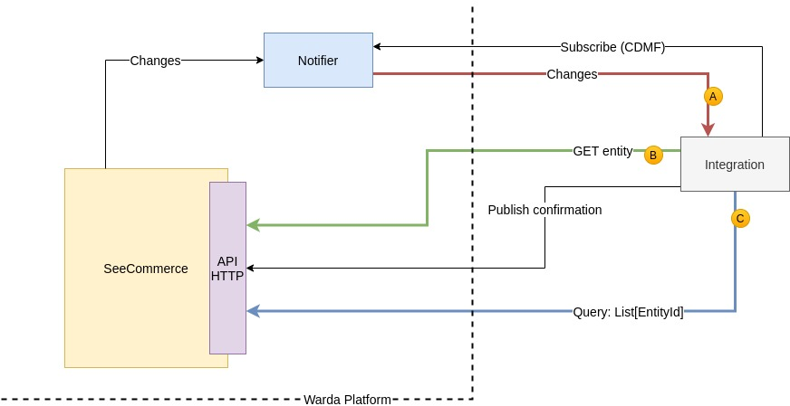

# CDMF 2.0 API

CATALOG DATA MASTER FEED API

## INTRODUCTION
CDMF is a flexible API that allows system integrations to retrieve catalog data from SeeCommerce. Thanks to the
multiple HTTP API requests available, it's possible to define workflows appropriate for different system integration
needs and scenarios.



## MISSION STATEMENT
Just like its [1.0](CDMF1.md) counterpart, the new CDMF API offers a way to synchronize publishable data from SeeCommerce, so that a system integration can publish it
on a third party platform (e.g. e-commerce website). The specific data format depends on the configuration for the specific customer in terms
of product structure (e.g. keys, aggregation levels and attributes).
One of the core differences between the CDMF 1.0 API and the 2.0 one is that the integration workflow with the latter is more
flexible and customizable.
It's important to note that while at first the two systems will coexist, at some point **the CDMF 2.0 API will to completely replace the 1.0 one**.

### PUBLISHABLE DATA
SeeCommerce's publishable data is composed of attributes and media that have been marked as ready for publication.
While the CDMF 1.0 API required the system integration to explicitly confirm the data it received so that it wouldn't be delivered again, with the new
CDMF 2.0 API this is no longer necessary.
The new CDMF DATA FEED delivers data changes to the system integration through HTTP requests to the configured endpoint; then,
the system integration's HTTP response to said request will determine whether the same data must be delivered again:

* **HTTP 2XX response**: the system integration successfully received the changes. CDMF DATA FEED will consider it as delivered, therefore it won't send it again.
* **HTTP 4XX and 5XX responses**: an error occurred, and the system integration likely didn't receive the changes. Depending on the error cause, a specific retry policy will come into action and CDMF DATA FEED will send the changes again.

It's important to note that an HTTP 2XX response from a system integration only means that the system integration successfully received the data.
Therefore, an HTTP 2XX response has no correlation with the CDMF CONFIRMATION API that will be described later.

If necessary, a product's full up-to-date publishable data can still be retrieved by sending requests to the CDMF PRODUCT DATA RETRIEVAL API.

```bash
curl --request POST \
  --url http://api-test.wardacloud.com/cdmf/v2/subscriptions \
  --header 'Authorization: Bearer <USER_JWT>' \
  --header 'Content-Type: application/json' \
  --data '{
	"endpoint": {
		"type": "jwt",
		"url": "<INTEGRATION_ENDPOINT>",
		"jwt": "<JWT>",
		"bearer": true
	},
  "catalogs": ["catA", "catB"]
}'
```

## SERVICE TEMPLATE
To make CDMF integrations easier, we provide a Java service template that can already interact with the above API endpoints. You can use this template as a base to build your own custom system integration.
